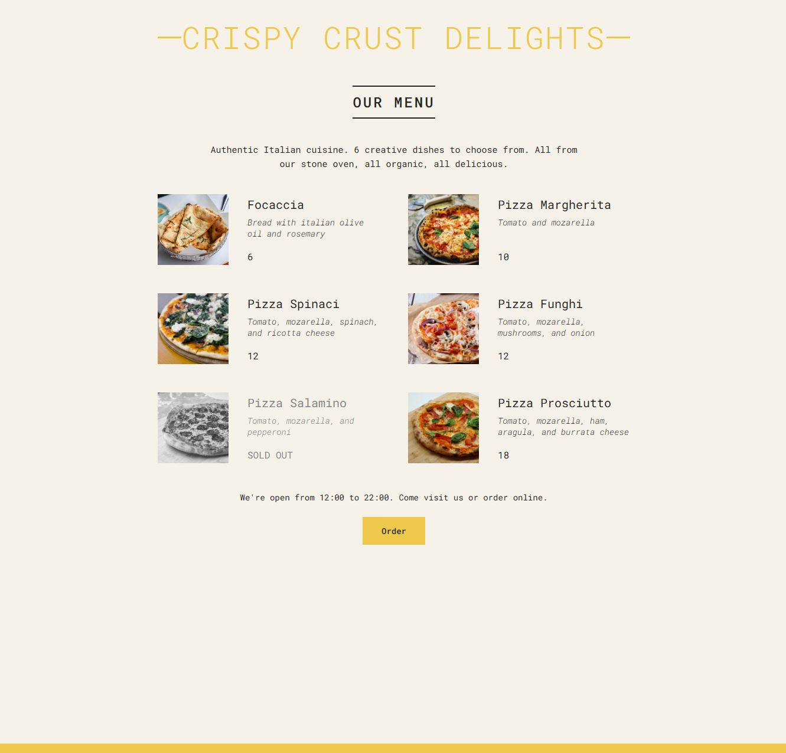

# Crispy Crust Delights 🍕

Welcome to **Crispy Crust Delights** – a simple yet delightful pizza menu application built with React! This project showcases a static UI for a pizza restaurant, with a focus on displaying a menu, dynamic styling, and a clean, responsive design.

## Features

- Display of various pizza items with descriptions, ingredients, and prices
- "Sold Out" state for items not currently available
- Order button (non-functional placeholder for UI purposes)
- Responsive layout for a smooth experience on all device sizes

## Demo

Check out the live version:

[https://crispy-crust-delights.vercel.app/](https://crispy-crust-delights.vercel.app/)

## Technologies Used

- React – for building the UI components
- CSS – for styling and responsive design

## Installation

To run this project locally, follow these steps:

1. Clone this repository:
   `git clone https://github.com/MilotaiEduard/Crispy-Crust-Delights.git`
2. Navigate to the project folder:
   `cd Crispy-Crust-Delights`
3. Install dependencies:
   `npm install`
4. Start the development server:
   `npm start`

The application will open on `http://localhost:3000`.

## Project Structure

- `/src`: Contains the main components and data for the menu.
- `/public`: Stores static assets like images.
